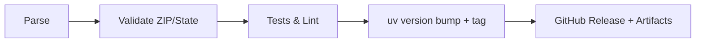

# RyanData Address Utils

[](https://github.com/Abstract-Data/RyanData-Address-Utils/actions/workflows/tests.yml)
[](https://github.com/Abstract-Data/RyanData-Address-Utils/actions/workflows/lint.yml)
[](https://github.com/Abstract-Data/RyanData-Address-Utils/actions/workflows/typecheck.yml)
[](https://www.python.org/downloads/)
[](https://github.com/astral-sh/uv)
[](https://opensource.org/licenses/MIT)

Parse and validate US addresses with Pydantic models, ZIP/state validation, pandas integration, and semantic-release powered CI.

## Highlights

- Structured parsing of US addresses into 26 components with Pydantic models
- ZIP and state validation backed by authoritative datasets
- Pandas-friendly parsing for batch workloads
- Custom errors (`RyanDataAddressError`, `RyanDataValidationError`) with package context
- Builder API for programmatic address construction
- Semantic-release CI for automated tagging and releases

## Install

### uv (recommended)

```bash
uv add git+https://github.com/Abstract-Data/RyanData-Address-Utils.git
# with pandas extras
uv add "ryandata-address-utils[pandas] @ git+https://github.com/Abstract-Data/RyanData-Address-Utils.git"
# with API + remote Docker helpers
uv add "ryandata-address-utils[api,remote] @ git+https://github.com/Abstract-Data/RyanData-Address-Utils.git"
```

### pip

```bash
pip install git+https://github.com/Abstract-Data/RyanData-Address-Utils.git
pip install "ryandata-address-utils[pandas] @ git+https://github.com/Abstract-Data/RyanData-Address-Utils.git"
# with API + remote Docker helpers
pip install "ryandata-address-utils[api,remote] @ git+https://github.com/Abstract-Data/RyanData-Address-Utils.git"
```

### Setup cheat sheet (pick what you need)

- Local parsing only: install base package (no extras) and call `parse(...)` or `AddressService`.
- Pandas workflows: add the `[pandas]` extra so `parse_dataframe` works without optional import errors.
- FastAPI service + libpostal: add `[api]` (bundles FastAPI/uvicorn/postal) and run `uvicorn ryandata_address_utils.api:app --host 0.0.0.0 --port 8000` or use `make docker-run-api`.
- Remote Docker helper/client: add `[remote]`; if Docker is available, `parse_remote(...)` can auto-start the libpostal API container, or point it at an existing base URL via `RYANDATA_LIBPOSTAL_URL`.
- One container can serve many projects: start it once (e.g., `docker run -p 8000:8000 ghcr.io/abstract-data/ryandata-addr-utils-libpostal:latest`) and set `RYANDATA_LIBPOSTAL_URL=http://localhost:8000` in each project.

## Docker (libpostal-ready, “clone and go”)

Build (with libpostal and this package installed from the chosen ref):

```bash
make docker-build            # builds ghcr.io/abstract-data/ryandata-addr-utils-libpostal:latest
make docker-test             # quick parse inside container
```

Shell into the image:

```bash
make docker-shell
```

Run the optional API (FastAPI) on port 8000:

```bash
make docker-run-api
# Then call:
# curl "http://localhost:8000/parse?address=123%20Main%20St,%20Austin%20TX%2078749"
# International (if libpostal available in image):
# curl "http://localhost:8000/parse_international?address=10%20Downing%20St,%20London"
```

### International parsing (libpostal)

- `parse_auto_route` (service) and `/parse_auto` (API) try US first, then libpostal if US validation fails.
- Strict rules: international results must include a road plus at least one location element (city/state/postal/country) or parsing fails.
- Returned structure includes `InternationalAddress` fields (`HouseNumber`, `Road`, `City`, `State`, `PostalCode`, `Country`, `CountryCode`) and raw libpostal `Components`.
- Requires libpostal installed; the provided Docker image already bundles it. Outside Docker, install libpostal first.
- Heuristics: if the input clearly names a non-US country or contains non-ASCII, it skips US parsing and goes straight to libpostal; otherwise, US is attempted first and any US validation failure triggers libpostal fallback.

Notes:

- Image name: `ghcr.io/abstract-data/ryandata-addr-utils-libpostal` (configurable via `DOCKER_IMAGE`, `DOCKER_TAG`, `DOCKER_REF`).
- The image bundles libpostal; use it when you need international parsing without host installs.

## Remote libpostal API + Python client

- The libpostal-enabled image now runs a FastAPI service (`/health`, `/parse`, `/parse_international`, `/parse_auto`) by default. Start it manually:  
  `docker run -p 8000:8000 ghcr.io/abstract-data/ryandata-addr-utils-libpostal:latest`

- Python client with auto-start (requires Docker + `ryandata-address-utils[remote]`):  

  ```python
  from ryandata_address_utils import parse_remote

  result = parse_remote("10 Downing St, London")
  print(result.is_valid, result.source, result.to_dict())
  ```

- Target an existing service (no Docker needed):  

  ```python
  from ryandata_address_utils import LibpostalRemoteClient

  client = LibpostalRemoteClient(base_url="http://my-libpostal:8000", auto_start=False)
  result = client.parse_auto("123 Main St, Austin TX")
  ```

- Env toggles:  
  - `RYANDATA_LIBPOSTAL_URL` – override base URL (disables auto-start)  
  - `RYANDATA_LIBPOSTAL_AUTOSTART` – `0`/`1` to disable/enable Docker auto-start (default on)  
  - `RYANDATA_LIBPOSTAL_IMAGE`, `RYANDATA_LIBPOSTAL_CONTAINER`, `RYANDATA_LIBPOSTAL_PORT` – image name, container name, host port

## Quick start

```python
from ryandata_address_utils import AddressService, parse

result = parse("123 Main St, Austin TX 78749")
if result.is_valid:
    print(result.address.ZipCode)   # "78749"
    print(result.to_dict())         # full address dict
else:
    print(result.validation.errors) # custom errors with context

service = AddressService()
service.parse("456 Oak Ave, Dallas TX 75201")
```

## Pandas integration

```python
import pandas as pd
from ryandata_address_utils import AddressService

df = pd.DataFrame({"address": ["123 Main St, Austin TX 78749", "456 Oak Ave, Dallas TX 75201"]})
service = AddressService()

parsed = service.parse_dataframe(df, "address", prefix="addr_")
print(parsed[["addr_AddressNumber", "addr_StreetName", "addr_ZipCode"]])
```

## Programmatic build

```python
from ryandata_address_utils import AddressBuilder

address = (
    AddressBuilder()
    .with_street_number("123")
    .with_street_name("Main")
    .with_street_type("St")
    .with_city("Austin")
    .with_state("TX")
    .with_zip("78749")
    .build()
)
```

## Workflow at a glance



## APIs you get

- `AddressService`: parse single, batch, DataFrame; look up ZIP/state; validate
- `parse(...)`: convenience wrapper returning `ParseResult`
- ZIP utilities: `get_city_state_from_zip`, `get_zip_info`, `is_valid_zip`, `is_valid_state`, `normalize_state`
- Builder: `AddressBuilder` for programmatic address construction

## Development (uv)

```bash
git clone https://github.com/Abstract-Data/RyanData-Address-Utils.git
cd RyanData-Address-Utils
uv sync
uv run pytest
uv run ruff check src/
uv run mypy src/
uv run ruff format src/
```

## Contributing and support

- Issues: <https://github.com/Abstract-Data/RyanData-Address-Utils/issues>
- Releases/notes: <https://github.com/Abstract-Data/RyanData-Address-Utils/releases>
- License: MIT
