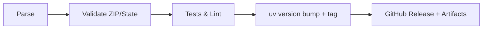

# RyanData Address Utils

[](https://github.com/Abstract-Data/RyanData-Address-Utils/actions/workflows/tests.yml)
[](https://github.com/Abstract-Data/RyanData-Address-Utils/actions/workflows/lint.yml)
[](https://github.com/Abstract-Data/RyanData-Address-Utils/actions/workflows/typecheck.yml)
[](https://codecov.io/gh/Abstract-Data/RyanData-Address-Utils)
[](https://www.python.org/downloads/)
[](https://github.com/astral-sh/uv)
[](https://opensource.org/licenses/MIT)

Parse and validate US addresses with Pydantic models, ZIP/state validation, pandas integration, and semantic-release powered CI.

## Highlights

- Structured parsing of US addresses into 26 components with Pydantic models
- ZIP and state validation backed by authoritative datasets
- Pandas-friendly parsing for batch workloads
- Custom errors (`RyanDataAddressError`, `RyanDataValidationError`) with package context
- Builder API for programmatic address construction
- Semantic-release CI for automated tagging and releases

## Install

### uv (recommended)

```bash
uv add git+https://github.com/Abstract-Data/RyanData-Address-Utils.git
# with pandas extras
uv add "ryandata-address-utils[pandas] @ git+https://github.com/Abstract-Data/RyanData-Address-Utils.git"
```

### pip

```bash
pip install git+https://github.com/Abstract-Data/RyanData-Address-Utils.git
pip install "ryandata-address-utils[pandas] @ git+https://github.com/Abstract-Data/RyanData-Address-Utils.git"
```

### Setup cheat sheet (pick what you need)

- Local parsing only: install base package (no extras) and call `parse(...)` or `AddressService`.
- Pandas workflows: add the `[pandas]` extra so `parse_dataframe` works without optional import errors.
- Libpostal setup (local, no Docker): run `uv run ryandata-address-utils-setup` and follow the prompts. The default data directory is system-wide (e.g., `/usr/local/share/libpostal` or `C:\\libpostal`); override it if you prefer and set `LIBPOSTAL_DATA_DIR` accordingly.
- The setup command detects your OS, attempts installation via Homebrew/apt/dnf/yum where available, and downloads the official libpostal data archives into the chosen directory.

### International parsing (libpostal)

- `parse_auto` (service) tries US first, then libpostal if US validation fails.
- Strict rules: international results must include a road plus at least one location element (city/state/postal/country) or parsing fails.
- Returned structure includes `InternationalAddress` fields (`HouseNumber`, `Road`, `City`, `State`, `PostalCode`, `Country`, `CountryCode`) and raw libpostal `Components`.
- Requires libpostal installed; use the setup helper (`uv run ryandata-address-utils-setup`) to install locally and download data.
- Heuristics: if the input clearly names a non-US country or contains non-ASCII, it skips US parsing and goes straight to libpostal; otherwise, US is attempted first and any US validation failure triggers libpostal fallback.

## Quick start

```python
from ryandata_address_utils import AddressService, parse

result = parse("123 Main St, Austin TX 78749")
if result.is_valid:
    print(result.address.ZipCode)   # "78749"
    print(result.to_dict())         # full address dict
else:
    print(result.validation.errors) # custom errors with context

service = AddressService()
service.parse("456 Oak Ave, Dallas TX 75201")
```

## Pandas integration

```python
import pandas as pd
from ryandata_address_utils import AddressService

df = pd.DataFrame({"address": ["123 Main St, Austin TX 78749", "456 Oak Ave, Dallas TX 75201"]})
service = AddressService()

parsed = service.parse_dataframe(df, "address", prefix="addr_")
print(parsed[["addr_AddressNumber", "addr_StreetName", "addr_ZipCode"]])
```

## Programmatic build

```python
from ryandata_address_utils import AddressBuilder

address = (
    AddressBuilder()
    .with_street_number("123")
    .with_street_name("Main")
    .with_street_type("St")
    .with_city("Austin")
    .with_state("TX")
    .with_zip("78749")
    .build()
)
```

## Workflow at a glance



## APIs you get

- `AddressService`: parse single, batch, DataFrame; look up ZIP/state; validate
- `parse(...)`: convenience wrapper returning `ParseResult`
- ZIP utilities: `get_city_state_from_zip`, `get_zip_info`, `is_valid_zip`, `is_valid_state`, `normalize_state`
- Builder: `AddressBuilder` for programmatic address construction

## Documentation

- **[Architecture Overview](docs/ARCHITECTURE.md)** - Package structure, data flow diagrams, design patterns, and SOLID/DRY principles applied
- **[Diagrams](docs/diagrams.md)** - Visual references for the codebase

## Development (uv)

```bash
git clone https://github.com/Abstract-Data/RyanData-Address-Utils.git
cd RyanData-Address-Utils
uv sync
uv run pytest
uv run ruff check src/
uv run mypy src/
uv run ruff format src/
```

## Agent Workflow (Cursor)

This project uses a structured parallel agent workflow for AI-assisted development. See [`.cursor/agents.md`](.cursor/agents.md) for:

- **STEP/AGENT naming convention** for organizing parallel tasks
- **Specialized agents**: CodeAgent, TestAgent, DocsAgent, RefactorAgent, ConfigAgent
- **Execution rules** for coordinating multi-agent work
- **Task templates** for features, bug fixes, and refactoring

Example todo format:
```
STEP1 - CodeAgent: Implement core data models
STEP1 - TestAgent: Create test scaffolding
STEP2 - CodeAgent: Wire up service layer (runs after STEP1)
```

## Contributing and support

- Issues: <https://github.com/Abstract-Data/RyanData-Address-Utils/issues>
- Releases/notes: <https://github.com/Abstract-Data/RyanData-Address-Utils/releases>
- Architecture: [docs/ARCHITECTURE.md](docs/ARCHITECTURE.md)
- License: MIT
