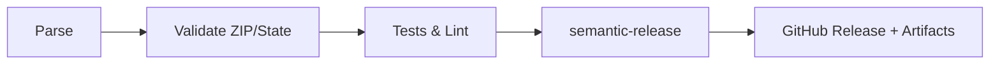

# RyanData Address Utils

[](https://github.com/Abstract-Data/RyanData-Address-Utils/actions/workflows/tests.yml)
[](https://github.com/Abstract-Data/RyanData-Address-Utils/actions/workflows/lint.yml)
[](https://github.com/Abstract-Data/RyanData-Address-Utils/actions/workflows/typecheck.yml)
[](https://www.python.org/downloads/)
[](https://github.com/astral-sh/uv)
[](https://opensource.org/licenses/MIT)

Parse and validate US addresses with Pydantic models, ZIP/state validation, pandas integration, and semantic-release powered CI.

## Highlights

- Structured parsing of US addresses into 26 components with Pydantic models
- ZIP and state validation backed by authoritative datasets
- Pandas-friendly parsing for batch workloads
- Custom errors (`RyanDataAddressError`, `RyanDataValidationError`) with package context
- Builder API for programmatic address construction
- Semantic-release CI for automated tagging and releases

## Install

### uv (recommended)
```bash
uv add git+https://github.com/Abstract-Data/RyanData-Address-Utils.git
# with pandas extras
uv add "ryandata-address-utils[pandas] @ git+https://github.com/Abstract-Data/RyanData-Address-Utils.git"
```

### pip
```bash
pip install git+https://github.com/Abstract-Data/RyanData-Address-Utils.git
pip install "ryandata-address-utils[pandas] @ git+https://github.com/Abstract-Data/RyanData-Address-Utils.git"
```

## Quick start

```python
from ryandata_address_utils import AddressService, parse

result = parse("123 Main St, Austin TX 78749")
if result.is_valid:
    print(result.address.ZipCode)   # "78749"
    print(result.to_dict())         # full address dict
else:
    print(result.validation.errors) # custom errors with context

service = AddressService()
service.parse("456 Oak Ave, Dallas TX 75201")
```

## Pandas integration

```python
import pandas as pd
from ryandata_address_utils import AddressService

df = pd.DataFrame({"address": ["123 Main St, Austin TX 78749", "456 Oak Ave, Dallas TX 75201"]})
service = AddressService()

parsed = service.parse_dataframe(df, "address", prefix="addr_")
print(parsed[["addr_AddressNumber", "addr_StreetName", "addr_ZipCode"]])
```

## Programmatic build

```python
from ryandata_address_utils import AddressBuilder

address = (
    AddressBuilder()
    .with_street_number("123")
    .with_street_name("Main")
    .with_street_type("St")
    .with_city("Austin")
    .with_state("TX")
    .with_zip("78749")
    .build()
)
```

## Workflow at a glance



## APIs you get

- `AddressService`: parse single, batch, DataFrame; look up ZIP/state; validate
- `parse(...)`: convenience wrapper returning `ParseResult`
- ZIP utilities: `get_city_state_from_zip`, `get_zip_info`, `is_valid_zip`, `is_valid_state`, `normalize_state`
- Builder: `AddressBuilder` for programmatic address construction

## Development (uv)

```bash
git clone https://github.com/Abstract-Data/RyanData-Address-Utils.git
cd RyanData-Address-Utils
uv sync
uv run pytest
uv run ruff check src/
uv run mypy src/
uv run ruff format src/
```

## Contributing and support
- Issues: https://github.com/Abstract-Data/RyanData-Address-Utils/issues
- Releases/notes: https://github.com/Abstract-Data/RyanData-Address-Utils/releases
- License: MIT
