# RyanData Address Utils - Visual Diagrams

These diagrams can be rendered using:
- GitHub (automatic rendering in markdown)
- VS Code with Mermaid extension
- [Mermaid Live Editor](https://mermaid.live)

---

## 1. Component Architecture


---

## 2. Parse Flow Sequence


---

## 3. Class Hierarchy


---

## 4. Package Dependencies


---

## 5. Data Model Structure

```mermaid
erDiagram
    ParseResult ||--o| Address : contains
    ParseResult ||--o| InternationalAddress : contains
    ParseResult ||--|| ProcessLog : has
    ParseResult ||--o| ValidationResult : has

    Address ||--o{ AddressField : has_components
    Address ||--|| ZipCodeResult : validated_by

    ProcessLog ||--o{ ProcessEntry : contains

    ValidationResult ||--o{ ValidationError : contains

    ParseResult {
        string raw_input
        Address address
        InternationalAddress international_address
        Exception error
        ValidationResult validation
        ProcessLog process_log
    }

    Address {
        string AddressNumber
        string StreetName
        string StreetNamePostType
        string PlaceName
        string StateName
        string ZipCode5
        string ZipCode4
        string FullAddress
    }

    ProcessEntry {
        string entry_type
        string field
        string message
        string original_value
        string new_value
        string timestamp
    }

    ValidationError {
        string field
        string message
        string value
    }
```



---

## 6. Transformation Tracking Flow


---

## How to View These Diagrams

### Option 1: GitHub
Simply push this file to GitHub - it renders Mermaid diagrams automatically.

### Option 2: VS Code
Install the "Markdown Preview Mermaid Support" extension.

### Option 3: Online
Copy the Mermaid code blocks to [mermaid.live](https://mermaid.live) for interactive editing and PNG/SVG export.

### Option 4: Generate Images
```bash
# Install mermaid-cli
npm install -g @mermaid-js/mermaid-cli

# Generate PNG
mmdc -i docs/diagrams.md -o docs/architecture.png
```
